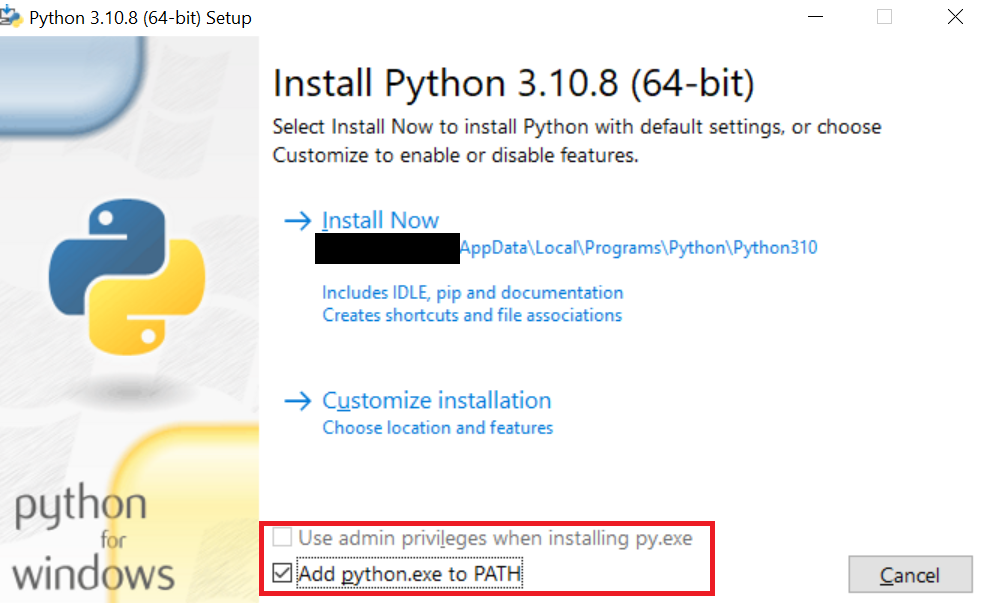

# Python setup on Windows

## Installing Python

Python installers are available from [Python.org](https://www.python.org/downloads/). 3.10.8 is the latest stable release 
at the time of writing, and the default available for download. When opening the launcher, make sure
the option to add python to your PATH is ticked:



These options require admin privileges. There are ways
to install on a per-user basis but that's beyond the scope of this doc. After installation, reboot
to ensure the environment variables have been applied by Windows correctly. 

To ensure everything's installed correctly, open a command line and check --version for both Python and Pip:
```powershell
PS > python --version
Python 3.10.8
PS > pip --version
pip 22.2.2 from <blahblah>\pip (python 3.10)
```

You can now return to the setup doc and follow the rest of the guide.

### Gotchas and caveats

#### Permission errors

Security policies on a corporate laptop will likely interfere with some tooling such as virtual environments, as the 
way they work creates copies of executable files in sometimes oddly-located directories. This will usually 
crop up when you're trying to do 'normal' Python operations from within a Poetry shell, for example:

```
$ pip freeze
bash: <blah>/pip: Permission denied
```

or the slightly more informative Powershell output:

```
PS > pip freeze
Program 'pip.exe' failed to run: This program is blocked by group policy. For more information, contact your system administratorAt line:1 char:1
+ pip freeze
+ ~~~~~~~~~~.
At line:1 char:1
+ pip freeze
+ ~~~~~~~~~~
    + CategoryInfo          : ResourceUnavailable: (:) [], ApplicationFailedException
    + FullyQualifiedErrorId : NativeCommandFailed
```

However, commands used in this workshop should be accessible.

#### Git bash interactive issues

When trying to launch the REPL or any other interactive console session, Git Bash will hang, often without 
an error message, due to pty compatibility problems. Git Bash installs a wrapper application, winpty, to handle this, 
but you need to call it explicitly(`winpty python` vs `python`), so be careful copying/pasting commands if using this shell
or you may lock up your session and be forced to start a new one.