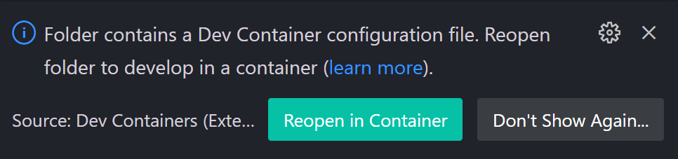
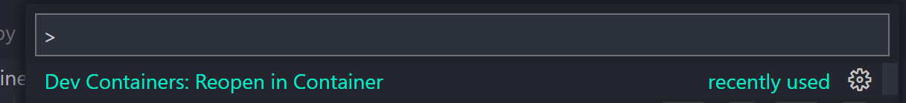
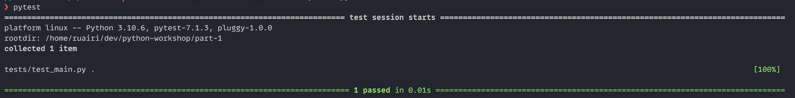
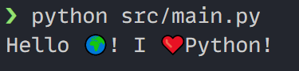

# Part 1 - Getting your environment setup

There are virtually infinite ways you could set up your development environment for python. In this section of the workshop, we will offer up some options. You can choose the one that works for you or ignore the suggestions completely. The goal is to set you up so you can run Python code. You're good to go if you can execute the commands at the end.

## Assumptions

You are running in a Unix-like environment e.g.

- Mac
- Linux (in a VM or otherwise)
- WSL2
- In a container

If you are using straight-up Windows and have a good setup, please consider contributing to this workshop with instructions for Windows users.

## Installing Python

You must use a recent version of python for this workshop. For the examples in this workshop, we have used `3.10.x`.

There are plenty of guides on how to install Python. Here is a couple:

- <https://realpython.com/installing-python/>
- <https://docs.python-guide.org/starting/installation/>

### Suggestion

Use [pyenv](https://github.com/pyenv/pyenv).

Pyenv is quite helpful and comes [with an installer](https://github.com/pyenv/pyenv-installer). It allows you to pick a python version and install it easily. It also allows you to switch between versions.

#### Other Suggestion

Use docker. Get an instant python development environment like so:

```bash
    docker run -it --rm python:3.10.8
```

Docker isn't always the best option. If you don't know how to use docker, this will be a bit of a learning curve. Using an intel Mac, your laptop will probably burst into flames.

If you have a good computer and know docker well, this is probably the fastest way to get up and running.

### VSCode and Docker user?

You could use [devcontainers](https://code.visualstudio.com/docs/remote/containers). An example of a devcontainer is in the [.devcontainer](./.devcontainer) directory. If you open this directory in VSCode you should see an option to open it in a devcontainer. If you do that, you will get a python development environment in VSCode. We will look at this in a little bit.

## Managing dependencies

Unfortunately, you may need to use someone else's code for something at some point. Python has a package manager called [pip](https://pip.pypa.io/en/stable/). There is also a package index called [pypi](https://pypi.org/). You can use pip to install packages from pypi.

When you install a package with pip, for example like so:

```bash
    pip install requests
```

That package becomes available in your python environment. You can then import it in your python code like so:

```python
    import requests
```

It's important to note that, by default, you install this package globally to your current environment. If you install a package in one project, it will be available in all other projects. This can be a problem if you have two projects that depend on different versions of the same package. One method of addressing this is to use [virtual environments](https://docs.python.org/3/tutorial/venv.html) to isolate your projects from each other.

### Poetry

There is a tool called [poetry](https://python-poetry.org/) that wraps the functionality of pip and venv using the [pyproject.toml convention](https://pip.pypa.io/en/stable/reference/build-system/pyproject-toml/). It allows you to create virtual environments and manage dependencies for your projects. It also allows you to lock down the versions of your dependencies.

We will use poetry throughout this workshop. You can choose not to use it if you prefer pip and venv but you will need to install the dependencies yourself.

To install poetry:
In subsequent steps, you can install dependencies and activate a virtual environment like so:

```bash
    poetry install
    poetry shell
```

## Code Editor

The choice of editor or IDE is entirely up to you, but some options are:

- [VSCode with python extensions](https://code.visualstudio.com/docs/languages/python)
- [PyCharm](https://www.jetbrains.com/pycharm/)
- [Vim + Python](https://realpython.com/vim-and-python-a-match-made-in-heaven/)

## Tutorial

### Clone the repo

```bash
    git clone git@github.com:ruarfff/python-workshop.git
    cd python-workshop
```

### Install Python

Install python using the previous instructions, whichever method you prefer.

If you are using VSCode + Docker, run: `code part-1` to open the directory in VSCode.

Once open, you may be prompted to open in a devcontainer.



If you are not, open a command (ctrl+shift+p) and search for `Dev Containers: Reopen in Container`.



### Install dependencies

Go to the [part-1](./part-1) directory and install the dependencies:

```bash
    cd part-1
    poetry install
```

### Activate the virtual environment

```bash
    poetry shell
```

### Run the tests

We'll look at testing later. For now, we are confirming that pytest was installed correctly and you can run it.

Run this command:

```bash
    pytest
```

You should see the following:



### Run the code

```bash
    python main.py
```

You should see the following:


